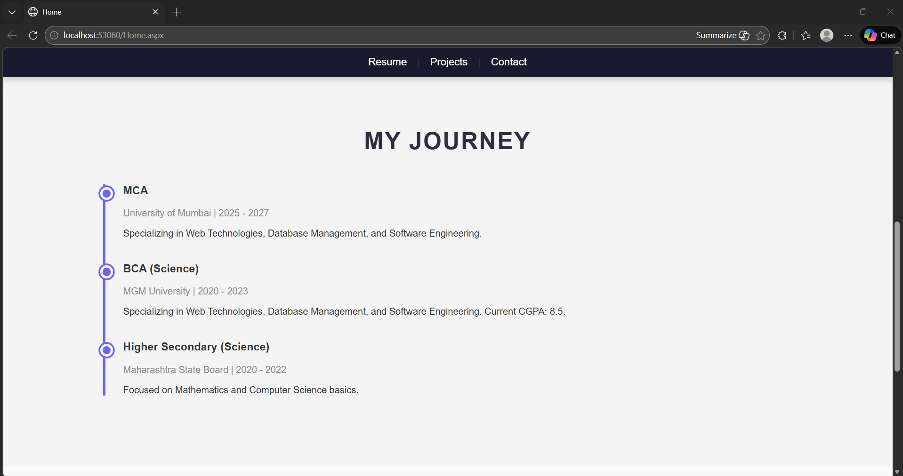
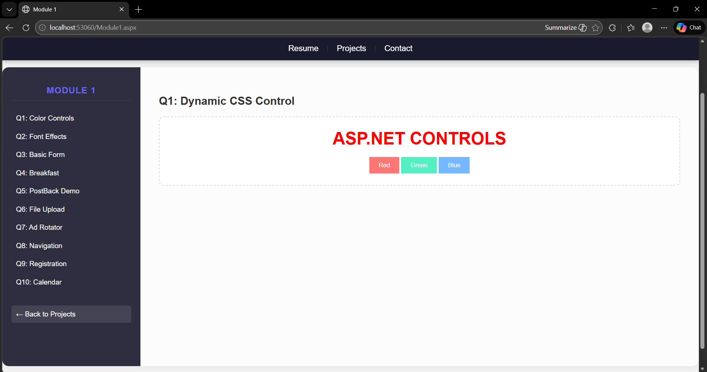
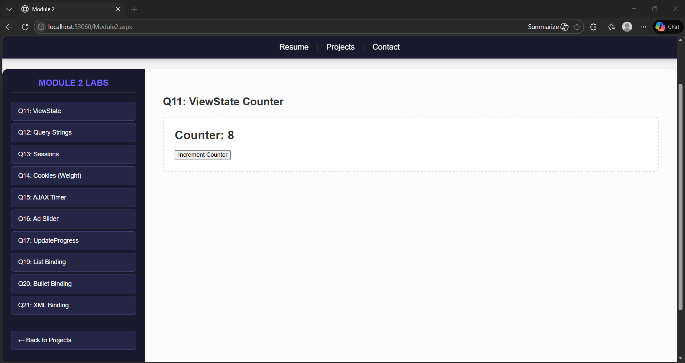
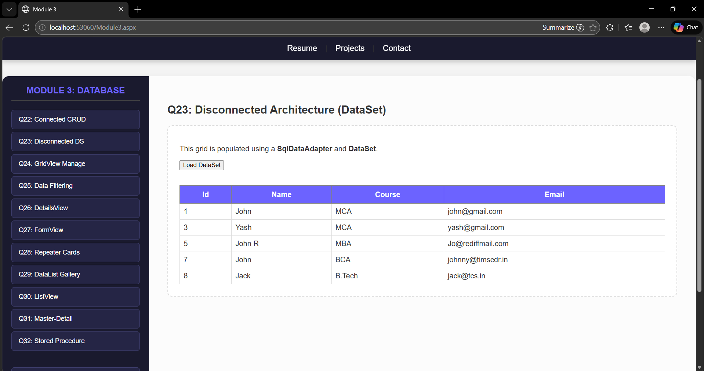
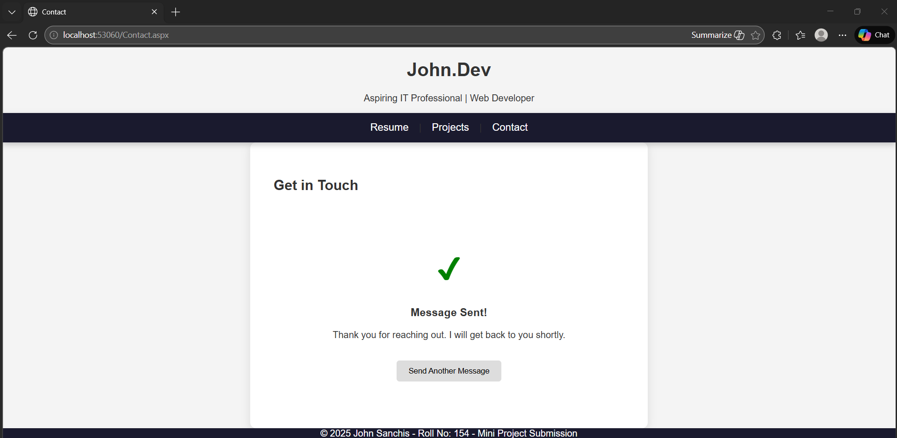
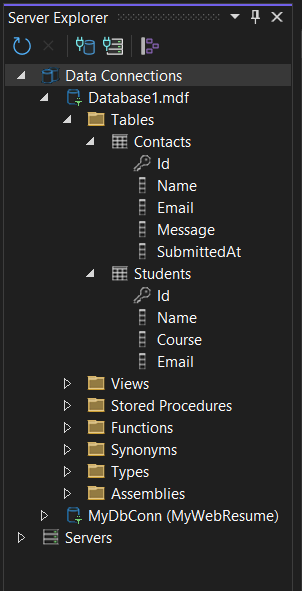
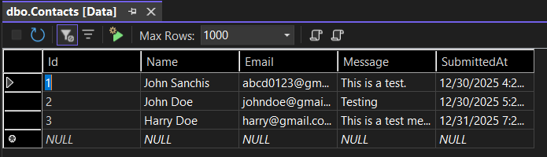

# 🚀 ASP.NET Full-Stack Portfolio: John Sanchis

A professional web application and lab console built using **ASP.NET WebForms** and **C#**. This project serves as a unified portfolio showcasing advanced web development concepts, state management, and database integration.

---

## 🖼️ Project Showcase

### **1. Professional Identity & Journey**
A modern landing page featuring a custom timeline and service overview.
| Home Dashboard | Career Journey |
|---|---|
|  |  |

### **2. The Interactive Lab Console**
Custom-built interfaces to toggle between experiments seamlessly.
| Module 1: UI Controls | Module 2: State Management |
|---|---|
|  |  |

### **3. Data Management (ADO.NET)**
Full implementation of Connected and Disconnected architectures using SQL Server.
| Dataset Integration | Contact Form Logic |
|---|---|
|  |  |

### **4. Backend & Database Structure**
The architectural backbone of the application.
| Database Schema | Contacts Data Table |
|---|---|
|  |  |

---

## 🛠️ Technical Stack
- **Backend:** C# (.NET Framework 4.7.2)
- **Frontend:** ASP.NET Web Forms, CSS3 (Modern Glassmorphism UI), Master Pages
- **Database:** SQL Server (LocalDB) via ADO.NET
- **Version Control:** Git & GitHub

## 📋 Module Overview
- **Module 1:** Dynamic CSS controls, File Uploads, and Navigation.
- **Module 2:** ViewState, Sessions, Cookies, and AJAX timers.
- **Module 3:** ADO.NET CRUD, GridView management, and Stored Procedures.
- **Module 4 & 5:** Web Services, User Controls, and Form Validation.

## 🚀 How to Run Locally
1. Clone the repository.
2. Open the `.sln` file in **Visual Studio**.
3. Ensure the `Database1.mdf` in `App_Data` is connected in Server Explorer.
4. Press `Ctrl + F5` to launch.

---
**Developed by John Sanchis** *Aspiring IT Professional | Full Stack Developer*
