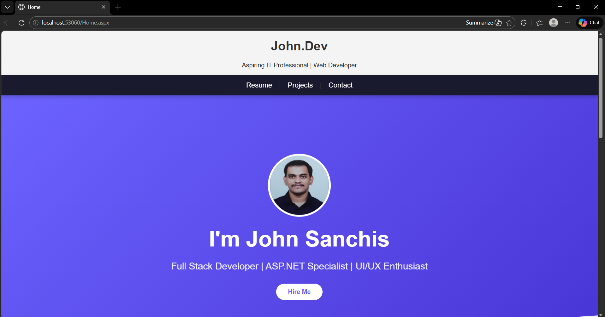
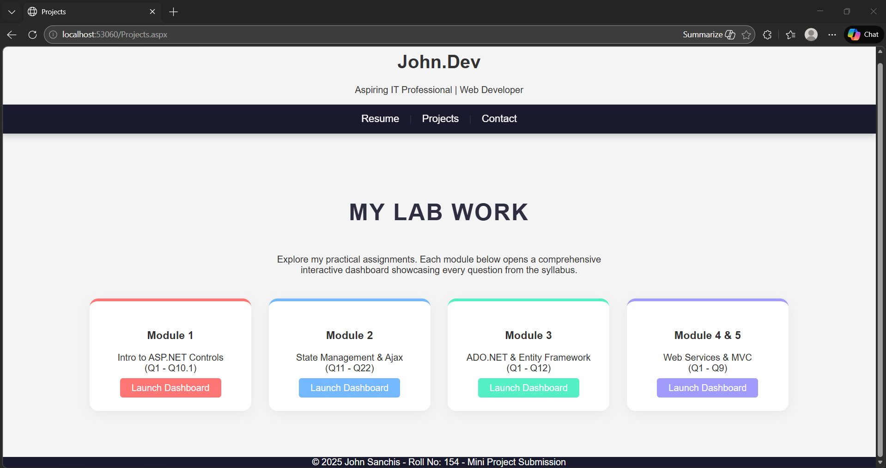

# 🚀 ASP.NET WebForms Full-Stack Portfolio

A professional, data-driven web application demonstrating the core pillars of the ASP.NET framework. This project integrates frontend design, server-side logic, and database management into a unified "Lab Console" interface.

---

## 🖼️ Gallery

### 1. Home Dashboard
*A modern landing page built with custom CSS and Master Pages.*

### 2. The Interactive Lab
*Using MultiView to switch between 40+ syllabus experiments seamlessly.*

### 3. Database Management (ADO.NET)
*Live CRUD operations (Create, Read, Update, Delete) connected to SQL Server.*

---

## 🛠️ Tech Stack
- **Backend:** C# (.NET Framework 4.7.2)
- **Frontend:** ASP.NET Web Forms, CSS3 (Custom UI)
- **Database:** SQL Server (LocalDB) via ADO.NET
- **Tools:** Visual Studio, Git Bash, GitHub

## 📋 Module Breakdown
- **Module 1 & 2:** Standard UI Controls, State Management (ViewState/Session), and Event Handling.
- **Module 3 (Data):** Implementation of **Connected & Disconnected architecture** to manage student records.
- **Module 4:** Component-based development using **User Controls** and consuming **ASMX Web Services**.
- **Module 5:** Secure input handling using the **ASP.NET Validation Framework**.

## ⚙️ Key Features
- **Master Page Architecture:** Ensures a consistent header, navigation, and footer across the site.
- **Validation Summary:** Centralized error reporting for high-quality user experience.
- **Global.asax:** Implementation of a real-time site visitor counter.
- **Clean Code:** Separation of concerns using the Code-Behind model (.aspx.cs).

## 🚀 How to Run
1. Clone the repo: `git clone https://github.com/Jsanchis01/My-ASP-NET-Portfolio.git`
2. Open the `.sln` file in **Visual Studio**.
3. Rebuild the solution to restore any packages.
4. Ensure `App_Data/Database1.mdf` is attached to your SQL LocalDB instance.
5. Press `Ctrl + F5` to launch.

---
Developed by **Jsanchis01** as part of the Advanced Web Development Lab.
